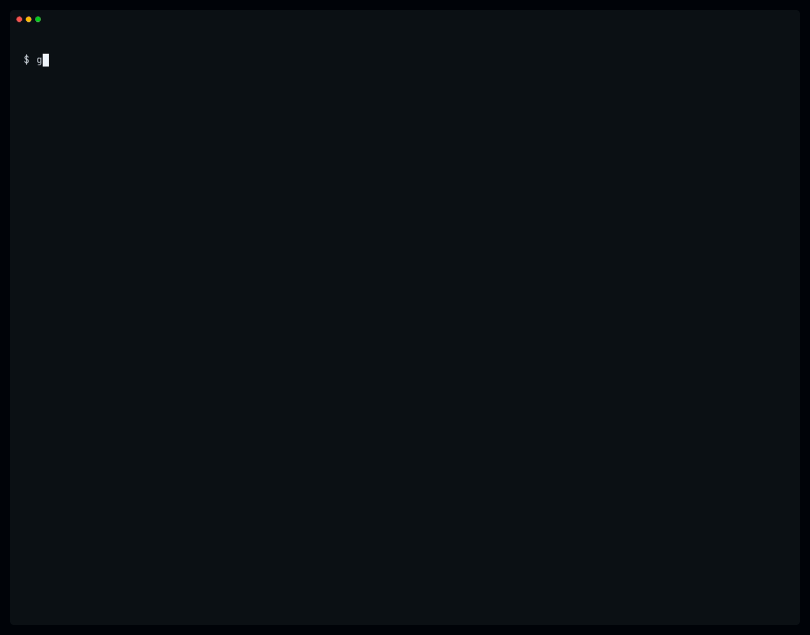
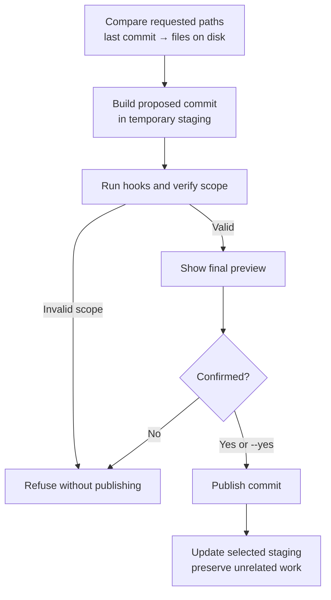

# subcommit

[](https://github.com/reemus-dev/subcommit/actions/workflows/ci.yml)
[](https://github.com/reemus-dev/subcommit/releases/latest)
[](https://skills.sh/reemus-dev/subcommit)



Commit only a slice of your changes while preserving unrelated work, without
going full git wizard.

- Commit selected files and/or line ranges
- Preserve unrelated staged, unstaged, and untracked work
- Protect against concurrent commit and staging conflicts
- Use it in scripts, automation, and concurrent agent workflows

## Contents

- [Why does this exist?](#why-does-this-exist)
- [Is it safe?](#is-it-safe)
- [When to use](#when-to-use)
- [Installation](#installation)
- [Usage](#usage)
  - [Targets](#targets)
  - [Commit message](#commit-message)
  - [Review and confirmation](#review-and-confirmation)
- [Behavior](#behavior)
  - [Selection and staging](#selection-and-staging)
  - [Line selection](#line-selection)
  - [Moves and renames](#moves-and-renames)
  - [Files and Git settings](#files-and-git-settings)
  - [Hooks](#hooks)
- [Limits](#limits)
- [Recovery](#recovery)
- [Design and safety](#design-and-safety)
  - [How it works](#how-it-works)
  - [Safety model](#safety-model)
- [Development](#development)
- [License](#license)

## Why does this exist?

To solve the pain of committing a subset of changes that arise from working with
multiple concurrent agents and user edits. Without it, you either:

- Use Git worktrees, which add setup and teardown and may require merging
- Execute a fragile sequence of Git operations:
  - save the existing staged state
  - stash unrelated unstaged and untracked work
  - reset and rebuild staging with only the desired files or hunks
  - create the commit
  - restore the stash and previous staged state

The solution is a CLI tool that replicates what most IDE commit tool windows do:

- Select one or more changed files
- Select changed regions within a file
- Commit those selections with a message

## Is it safe?

This CLI is nearly 100% vibed, so make of that what you will. But at least for
me, I'm confident in it because of:

- My extensive daily use of this tool across many projects
- A comprehensive test suite covering behavior and safety

Hopefully that gives you confidence too. For more info, see the
[safety model](#safety-model).

## When to use

```text
Commit all current changes?
  ├─ ✓ yes ─► git commit
  └─ ✗ no
      │
      ▼
Only complete changes to tracked files?
  ├─ ✓ yes, ordinary workflow ─► git commit -m "..." -- <paths>
  └─ ✗ no, or stronger isolation needed
      │
      ▼
Choose hunks interactively?
  ├─ ✓ yes ─► git add -p, an IDE, or a Git TUI
  └─ ✗ no
      │
      ▼
Can you name the exact files or current line ranges?
  ├─ ✗ no ──► use another Git workflow
  └─ ✓ yes
      │
      ▼
  ◆ subcommit
      ├─ commits only the requested selection
      ├─ accepts untracked files without prior staging
      ├─ preserves unrelated staged, unstaged, and untracked work
      ├─ guards against concurrent commit and staging conflicts
      └─ prevents hooks from widening the selection
```

## Installation

<!-- prettier-ignore -->
> [!NOTE]
> `subcommit` requires Git 2.36 or later. It has no other runtime dependencies.

### Mise

Install with [Mise](https://mise.jdx.dev/):

```sh
mise use -g github:reemus-dev/subcommit
```

### Install script

macOS and Linux (`-d <directory>` to install elsewhere):

```sh
# Install in `$HOME/.local/bin`
curl -fsSL https://raw.githubusercontent.com/reemus-dev/subcommit/main/assets/install.sh | bash

# Install system-wide
curl -fsSL https://raw.githubusercontent.com/reemus-dev/subcommit/main/assets/install.sh | sudo bash -s -- -d /usr/local/bin
```

Windows users:

```powershell
# Installs to `%LOCALAPPDATA%\Programs\subcommit\bin` and adds the directory to `PATH`
irm https://raw.githubusercontent.com/reemus-dev/subcommit/main/assets/install.ps1 | iex
```

Both scripts verify the release checksum and install `subcommit` and
`git-subcommit`.

### GitHub releases

Download an archive from the
[GitHub Releases](https://github.com/reemus-dev/subcommit/releases) page, then
copy `subcommit` and/or `git-subcommit` to a directory on `PATH`.

### From source

```sh
git clone https://github.com/reemus-dev/subcommit.git
cd subcommit
mise install
mise run build
```

The binaries are written to `bin/`. Copy `subcommit` and `git-subcommit`, with
`.exe` suffixes on Windows, to a directory on `PATH`.

### Agent skills

There are two optional agent skills. Both require `subcommit` to be installed.

| Skill                                    | Summary                                                                       |
| ---------------------------------------- | ----------------------------------------------------------------------------- |
| [`subcommit`](skills/subcommit/SKILL.md) | Minimal skill to make subcommit known and delegates usage guidance to the CLI |
| [`commit`](skills/commit/SKILL.md)       | Opinionated workflow for scope, grouping, and messaging                       |

Install either skill using the skills CLI:

```sh
# Choose interactively
npx skills add reemus-dev/subcommit
# Select a specific skill
npx skills add reemus-dev/subcommit --skill subcommit
npx skills add reemus-dev/subcommit --skill commit
```

### Shell completion

Generate completion for Bash, Zsh, Fish, or PowerShell:

```sh
subcommit --completion bash
subcommit --completion zsh
subcommit --completion fish
subcommit --completion powershell
```

Source it appropriately in your shell configuration file, example:

```sh
# ~/.bashrc
source <(subcommit --completion bash)
# ~/.zshrc
source <(subcommit --completion zsh)
```

Release archives include generated completion files under `completions/`. Bash
and Zsh completions also support `git subcommit`. File targets use shell path
completion. Append line ranges manually.

## Usage

```sh
# Direct
subcommit [<path|path:ranges>...] (-m <message> | -F <file>) [flags]

# Git integration
git subcommit [<path|path:ranges>...] (-m <message> | -F <file>) [flags]
```

**Examples**:

```sh
subcommit -m "..." path/file.ext
subcommit -m "..." path/file.ext:42-48
subcommit -m "..." path/file.ext:5 path/file.ext:42-48
subcommit -m "..." path/file.ext:5,42-48
```

### Targets

Each target selects either an entire file or changes touching specified lines.

**Entire file:** pass a path without a range suffix. This supports tracked
changes and deletions, untracked files, binary files, and symbolic links.

**Lines:** append line numbers or ranges to the path:

- `:12` selects changes touching line 12
- `:12-20` selects changes touching lines 12 through 20
- `:12,30-40` combines multiple ranges

Line numbers refer to the file as it currently appears on disk. For a deletion
with no replacement line, select an adjacent current line. If no current line
remains, select the entire file.

Multiple ranges may be comma-separated or passed by repeating the same path.

`subcommit` treats targets as literal paths rather than as Git patterns. Your
shell may still interpret characters such as `*`, `?`, `[]`, or parentheses, so
quote paths containing them. Use `--complete` when a literal filename ends in
valid range syntax, such as `report:42`.

```sh
subcommit --complete report:42 -m "..."
```

### Commit message

Every commit requires exactly one message source.

Use `-m` to supply the message directly:

```sh
subcommit path/file.ext -m "..."
```

Use `-F` to read a longer message from a file:

```sh
subcommit path/file.ext -F message.txt
```

`-F -` reads the message from standard input. Pass `--yes` when piping input
because interactive confirmation is unavailable:

```sh
printf 'subject\n\nbody\n' | subcommit path/file.ext -F - --yes
```

### Review and confirmation

By default, `subcommit` previews the candidate commit and asks for confirmation.
The preview shows a diff summary, the effective patch for line-selected files,
the commit message, accepted hook changes, and unrelated work that will remain
uncommitted.

Use `--yes` to skip confirmation. It is required when no interactive terminal is
available.

`--quiet` suppresses the preview and most informational output. It does not skip
confirmation and still reports hook changes, errors, and recovery guidance.

On success:

- `stdout`: `committed: <full-sha>`
- `stderr`: previews, prompts, hook output, warnings, and errors

### Flags

| Flag                | Meaning                                            |
| ------------------- | -------------------------------------------------- |
| `-m`, `--message`   | Use the supplied commit message                    |
| `-F`, `--file`      | Read the message from a file, or stdin with `-`    |
| `--complete <path>` | Select a complete literal path, repeatable         |
| `-y`, `--yes`       | Publish without interactive confirmation           |
| `-n`, `--no-verify` | Skip `pre-commit` and `commit-msg` hooks           |
| `-q`, `--quiet`     | Suppress preview and informational output          |
| `-v`, `--verbose`   | Show every preserved path                          |
| `--color`           | Set color to `auto`, `always`, or `never`          |
| `--completion`      | Generate completion for a supported shell and exit |

## Behavior

`subcommit` favors predictable scope over best-effort commits. If it cannot
commit every requested target without affecting unrelated work, it refuses the
whole operation.

### Selection and staging

Selection comes from the difference between the last commit and the files
currently on disk. Existing staging does not determine what gets committed.

After a successful commit:

- Selected changes are committed
- Unrelated staged, unstaged, and untracked work remains in place
- Prior staging on a selected path is replaced by the successful selection
- Unselected changes in a partially committed file remain available

Every requested target must contribute a change. If a complete target is
unchanged on disk but has staged-only changes, `subcommit` refuses rather than
discarding them.

### Line selection

<!-- prettier-ignore -->
> [!IMPORTANT]
> A line number identifies a change, not an exact commit boundary. If that line belongs to a larger contiguous edit, the entire edit is committed. Review the effective patch before confirmation.

Repeated ranges for one file are combined. Selecting both the entire file and
specific lines from it is refused rather than silently broadening the commit.
Line selection supports modified regular files only.

### Moves and renames

If one file disappears and an identical new file appears, `subcommit` treats
them as a move. Selecting either path automatically includes both. Example:

```sh
git mv a.txt b.txt
subcommit -m "rename a to b" b.txt
```

If the moved file was also edited, or more than one identical match exists, name
both paths explicitly:

```sh
subcommit -m "move and edit" a.txt b.txt
```

### Files and Git settings

- **Directories:** cannot be selected directly.
- **Symbolic links:** are supported as complete targets, not line selections.
- **Symlinked directories:** tracked files reached through them follow
  `git commit` behavior. Untracked files reached through them are refused like
  `git add`.
- **Sparse checkout:** a file omitted from disk is treated as unchanged, not
  deleted. An existing selected file remains authoritative.
- **Executable permissions:** follow the repository's `core.fileMode` setting.
- **Commit signing:** follows `commit.gpgsign`. Malformed values are refused
  like Git.

### Hooks

`subcommit` itself does not rewrite files.

<!-- prettier-ignore -->
> [!WARNING]
> Hooks run before confirmation and may modify selected files. File changes are reported, but canceling does not undo them.

| Hook                 | Behavior                                                               |
| -------------------- | ---------------------------------------------------------------------- |
| `pre-commit`         | Runs against selected changes unless `--no-verify` is set              |
| `prepare-commit-msg` | Always runs and may rewrite the message                                |
| `commit-msg`         | Runs unless `--no-verify` is set and may rewrite or reject the message |
| `post-commit`        | Runs after the commit is published                                     |

After `pre-commit`, `subcommit` verifies that:

- complete-file targets may be formatted and restaged, but remain changed
- line-selected targets were not modified
- inferred moves still contain both endpoints
- unrelated changes were not added

Any scope change causes refusal. A failing `post-commit` produces a warning
because the commit has already succeeded.

## Limits

| Situation                                                 | Behavior                                                                                      |
| --------------------------------------------------------- | --------------------------------------------------------------------------------------------- |
| No existing commit                                        | Refuses. Create the initial commit with Git first.                                            |
| Merge, rebase, cherry-pick, revert, or bisect in progress | Refuses until the operation is completed or aborted.                                          |
| Current commit changes while `subcommit` runs             | Refuses and does not overwrite the newer commit.                                              |
| Files change while `subcommit` runs                       | Files are not locked. The captured version may be committed while later edits remain on disk. |
| Another process ignores Git's index lock                  | Its changes are outside `subcommit`'s concurrency guarantees.                                 |

## Recovery

Publishing requires updating both the current commit and Git's staging area.
Those updates cannot be one filesystem transaction.

| Failure point                     | Repository state                                                                                  | Recovery                                                                 |
| --------------------------------- | ------------------------------------------------------------------------------------------------- | ------------------------------------------------------------------------ |
| Before the current commit changes | The original commit and staging remain current. The candidate commit still exists.                | Use the printed `git cherry-pick <sha>` command or retry.                |
| After the current commit changes  | The new commit is current, but the staging update may be incomplete. Recovery files are retained. | Inspect the retained files and follow the printed recovery instructions. |

## Design and safety

### How it works



### Safety model

`subcommit` refuses rather than guesses when it cannot preserve the requested
scope safely.

**✅ Covered and tested · ❌ Not guaranteed or intentionally refused**

| Status | Area                    | Behavior                                                                    |
| ------ | ----------------------- | --------------------------------------------------------------------------- |
| ✅     | Requested scope         | Every target must contribute a change, or no commit is published.           |
| ✅     | Unrelated work          | Successful commits preserve unrelated staged, unstaged, and untracked work. |
| ✅     | Existing staging        | Previously staged changes cannot leak into the commit.                      |
| ✅     | Partial files           | Changes outside selected lines remain available.                            |
| ✅     | Hook scope              | Hooks cannot silently broaden path scope or mutate line-selected files.     |
| ✅     | Literal paths           | Filenames are not interpreted as Git patterns.                              |
| ✅     | Concurrent commits      | A newer commit is not overwritten. A losing operation remains retryable.    |
| ✅     | Concurrent staging      | Normal Git writers are coordinated through Git's index lock.                |
| ✅     | Recovery                | Failures report the candidate commit or retained recovery files.            |
| ❌     | Worktree locking        | Files are not frozen while the command runs.                                |
| ❌     | Automatic coordination  | Concurrent operations are not queued or merged automatically.               |
| ❌     | Hook rollback           | Canceling does not undo file changes made by hooks.                         |
| ❌     | Non-cooperative writers | Processes that ignore Git's locking protocol are not protected against.     |
| ❌     | Atomic publication      | The commit and staging update cannot be one filesystem transaction.         |
| ❌     | Complex Git operations  | Active merges, rebases, cherry-picks, reverts, and bisects are refused.     |

## Development

Install the pinned toolchain and run the canonical checks:

```sh
mise install
mise run check
```

Other canonical tasks include `mise run build`, `mise run test`,
`mise run lint`, and `mise run format`. Regenerate the README terminal demo with
`mise run demo` on macOS or Linux. The task runs
[VHS](https://github.com/charmbracelet/vhs) in Docker and is intentionally
excluded from CI.

Before tagging a release, run `mise run release:check` and inspect the artifacts
from `mise run release:snapshot`. Pushing a `v*` tag runs the release workflow
and publishes the GitHub Release with the mise-managed GoReleaser.

## License

[MIT](LICENSE)
